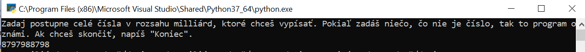
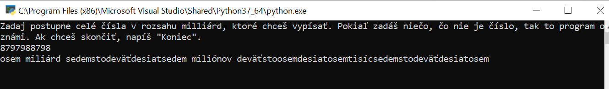

# Složenky
Tento zápočtový program vypíše zadané celé číslo v rozsahu miliárd zo vstupu slovom (aj záporné). Pokračuje, kým užívateľ nezadá koniec.

## Použitie
Pre začiatok spustite [main.py](main.py). Čísla môžete zadávať s medzerami alebo bez, program ich ignoruje.

Príklad platného vstupu.

A jeho výstup.

